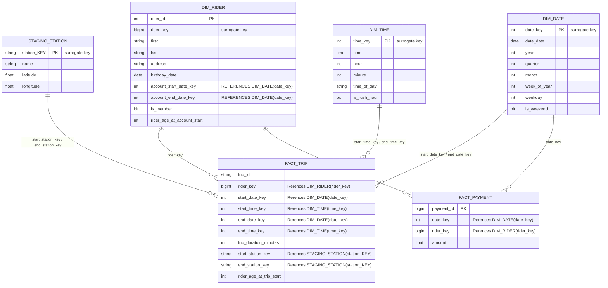

# Project Overview
Divvy is a bike sharing program in Chicago, Illinois USA that allows riders to purchase a pass at a kiosk or use a mobile application to unlock a bike at stations around the city and use the bike for a specified amount of time. The bikes can be returned to the same station or to another station. The City of Chicago makes the anonymized bike trip data publicly available for projects like this where we can analyze the data.

Since the data from Divvy are anonymous, we have created fake rider and account profiles along with fake payment data to go along with the data from Divvy. The dataset looks like this:

## Divvy ERD
This image represents the data model for the dataset based on the Divvy Bikeshare data. The tables include: Rider, Account, Payment, Trip, and Station.
Relational ERD for the Divvy Bikeshare Dataset (with fake data tables)


## Goal
The goal of this project is to develop a data warehouse solution using Azure Synapse Analytics. You will:

1. Design a star schema based on the business outcomes listed below;
2. Import the data into Synapse;
3. Transform the data into the star schema;
4. and finally, view the reports from Analytics.

## The business outcomes you are designing for are as follows:
Analyze how much time is spent per ride
- Based on date and time factors such as day of week and time of day
- Based on which station is the starting and / or ending station
- Based on age of the rider at time of the ride
- Based on whether the rider is a member or a casual rider

Analyze how much money is spent
- Per month, quarter, year
- Per member, based on the age of the rider at account start

EXTRA CREDIT - Analyze how much money is spent per member
- Based on how many rides the rider averages per month
- Based on how many minutes the rider spends on a bike per month

## Requirements
Use this project rubric to understand and assess the project criteria.

### Star Schema Design

| Criteria | Submission Requirements | Deliverable |
|---|---|---|
| The student will be able to generate fact tables based on a business need and a relational model | The dimensional model should have two fact tables sharing common dimensions where applicable. One should be related to trip facts and another should be related to payment facts. The trip fact should have fields for trip duration and rider age at time of trip. The payment fact should have a field related to amount of payment. | [Trip Fact](./sql/fact_trip.sql) and [Payment Fact](./sql/fact_payment.sql) |
| The student will be able to generate dimension tables based on business needs and a relational model | The star schema should have dimensions related to the trip fact table that are related to: riders, stations, and dates. The schema should have dimensions related to the payment fact table that are related to: dates and riders. | [Star Schema Divvy Bikeshare ERD](./diagrams/divvy_erd.pdf) |
| Extract Step | The screenshot will demonstrate the learner is able to extract data from PostgreSQL into Azure Blob Storage. The screenshot should be of the Azure Blob Storage and should contain 4 text files: public.payment, public.rider, public.trip, public.station. | [Screenshot of Blob storage](../images/succesful_ingestion_into_blob_storage.png)|
| Load Step | The student will be able to load data from Azure Blob Storage into external tables in the data warehouse. The student will have uploaded 4 separate script files. The SQL files should create tables using CREATE EXTERNAL TABLE (not just CREATE TABLE). The scripts should point to the four files in Blob Storage from the extract step. | Load [Payment](./sql/Load1_payment.sql), [Rider](./sql/Load2_rider.sql), [Station](./sql/Load3_station.sql), [Trip](./sql/Load4_trip.sql) |
| Transform Step | The scripts show the student is able to generate fact tables (CETAS) from staging tables. The fact table (CETAS) scripts should contain appropriate keys from the dimensions and should appropriately generate the correct facts based on the diagrams provided in the first step. | [Trip Fact](./sql/fact_trip.sql) and [Payment Fact](./sql/fact_payment.sql) + see [discussion below](#notes-on-the-transform-step) |
| Dimension Transform Requirements | The scripts show the student can generate dimension tables (CETAS) from staging tables. The dimension scripts (CETAS) should match the schema diagram. Dimensions should generate appropriate keys and should not contain facts. | [Date Dimension](./sql/dim_date.sql), [Time Dimension](./sql/dim_time.sql), [Rider Dimension](./sql/dim_rider.sql), [Staging Station](./sql/Load3_station.sql) (staging station was already in a good format)|
| Tips | Ensure the column names match the reference diagrams created in Step 1. For creating fact tables out of joins between dimensions and staging tables, consider using CETAS to materialize joined reference tables to a new file and then join to this single external table in subsequent queries. | N.A. |

## Star schema Diagram
[Here](./diagrams/divvy_er.pdf) you can find the Star Schema for the Divvy Bikeshare Dataset project; generated using mermaid.js from the corresponding code in the file [divvy_er.mmd](./diagrams/divvy_er.mmd).


## Notes on the Transform Step
From what I could find on [the creation of CETAS (Create External Table As Select)](https://learn.microsoft.com/en-us/sql/t-sql/statements/create-external-table-transact-sql?view=azure-sqldw-latest&preserve-view=true&tabs=serverless) in Azure Synapse Analytics, it appears that CETAS tables do not support foreign key constraints. Therefore, in the fact table creation scripts, I have not included foreign key references to the dimension tables. 

However, I manually enforced these relationships by ensuring that the keys used in the fact tables correspond correctly to the surrogate keys in the dimension tables. This approach maintains referential integrity without explicitly defining foreign key constraints in the CETAS tables. The fact table for trips is a good example of this:
```sql
CREATE EXTERNAL TABLE dbo.fact_trip
WITH (
    LOCATION     = 'fact_trip',
    DATA_SOURCE = [udacitydipdecourse_udacitydipdecourse_dfs_core_windows_net],
    FILE_FORMAT = [SynapseDelimitedTextFormat]
)
AS
SELECT
	st.trip_id AS trip_id,
	dr.rider_key AS rider_key,
	dd_start_date.date_key AS start_date_key,
	dt_start_time.time_key AS start_time_key,
	dd_end_date.date_key AS end_date_key,
	dt_end_time.time_key AS end_time_key,
	DATEDIFF(minute, TRY_CAST(st.start_at AS datetime), TRY_CAST(st.ended_at AS datetime)) AS trip_duration_minutes,
	ss.station_key AS start_station_key, 
	ss.station_key AS end_station_key, 
	DATEDIFF(year,dr.birthday_date,TRY_CAST(st.start_at AS datetime)) AS rider_age_at_trip_start
FROM dbo.staging_trip AS st
LEFT JOIN dbo.dim_date AS dd_start_date
	ON CONVERT(INT, FORMAT(TRY_CAST(st.[start_at] AS DATETIME), 'yyyyMMdd')) = dd_start_date.date_key
LEFT JOIN dbo.dim_time AS dt_start_time
	ON DATEPART(hour, TRY_CAST(st.[start_at] AS DATETIME)) * 60 + DATEPART(minute, TRY_CAST(st.[start_at] AS DATETIME)) = dt_start_time.time_key
LEFT JOIN dbo.dim_date AS dd_end_date
	ON CONVERT(INT, FORMAT(TRY_CAST(st.[ended_at] AS DATETIME), 'yyyyMMdd')) = dd_end_date.date_key
LEFT JOIN dbo.dim_time AS dt_end_time
	ON DATEPART(hour, TRY_CAST(st.[ended_at] AS DATETIME)) * 60 + DATEPART(minute, TRY_CAST(st.[ended_at] AS DATETIME)) = dt_end_time.time_key
LEFT JOIN dbo.dim_rider AS dr
	ON st.rider_id = dr.rider_key
LEFT JOIN dbo.staging_station AS ss
	ON st.start_station_id = ss.station_key
```
In particular, the rider, date, time and station keys in the `fact_trip` table are derived from their respective dimension tables, ensuring that each key corresponds to a valid entry in those tables. This method effectively maintains the integrity of the data relationships within the constraints of CETAS limitations. For example, the datetime `start_at` column of the `staging_trip` table is used to derive both the `start_date_key` and `start_time_key` by converting it to either a date or time key and joining with the `dim_date` and `dim_time` tables respectively.

## Additional Screenshots of Azure Synapse Analytics
- **Screenshot of all tables in SQL Pool:** 
- **Screenshot of lake storage with all files:** 
- **Screenshot of successful connection to Azure PostgreSQL DB:** 