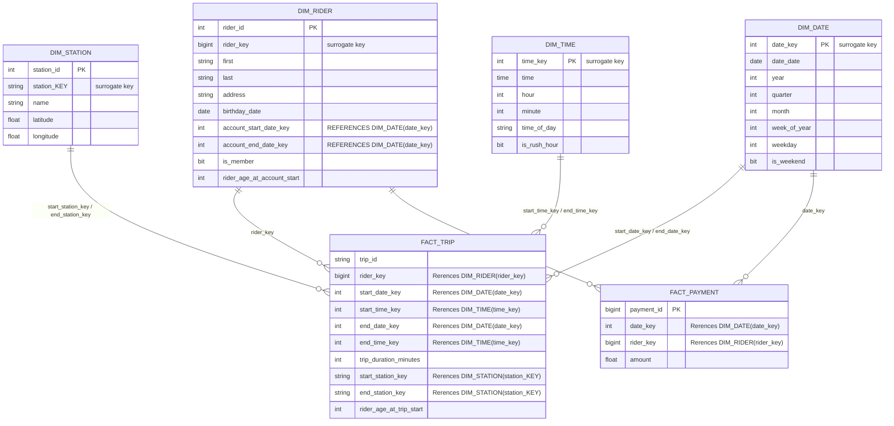

# Project Overview
In this project, you'll build a data lake solution for Divvy bikeshare.

Divvy is a bike sharing program in Chicago, Illinois USA that allows riders to purchase a pass at a kiosk or use a mobile application to unlock a bike at stations around the city and use the bike for a specified amount of time. The bikes can be returned to the same station or to another station. The City of Chicago makes the anonymized bike trip data publicly available for projects like this where we can analyze the data.

Since the data from Divvy are anonymous, we have generated fake rider and account profiles along with fake payment data to go along with the data from Divvy.

## Divvy ERD
This image represents the data model for the dataset based on the Divvy Bikeshare data. The tables include: Rider, Account, Payment, Trip, and Station.
Relational ERD for the Divvy Bikeshare Dataset (with fake data tables)

## Goal
The goal of this project is to develop a data warehouse solution using Azure Synapse Analytics. You will:

1. Design a star schema based on the business outcomes listed below;
2. Import the data into Synapse;
3. Transform the data into the star schema;
4. and finally, view the reports from Analytics.

## The business outcomes you are designing for are as follows:
Analyze how much time is spent per ride
- Based on date and time factors such as day of week and time of day
- Based on which station is the starting and / or ending station
- Based on age of the rider at time of the ride
- Based on whether the rider is a member or a casual rider

Analyze how much money is spent
- Per month, quarter, year
- Per member, based on the age of the rider at account start

EXTRA CREDIT - Analyze how much money is spent per member
- Based on how many rides the rider averages per month
- Based on how many minutes the rider spends on a bike per month

## Requirements
Use this project rubric to understand and assess the project criteria.

| Criteria | Submission Requirements | Deliverable |
|---|---|---|
| **Star Schema Design**   The student will be able to generate fact tables based on a business need and a relational model | The dimensional model should have two fact tables sharing common dimensions where applicable. One should be related to trip facts and another should be related to payment facts. The trip fact should have fields for trip duration and rider age at time of trip. The payment fact should have a field related to amount of payment. | See [Star Schema Design](#star-schema-diagram) |
| **Star Schema Design**   The student will be able to generate dimension tables based on business needs and a relational model | The star schema should have dimensions related to the trip fact table that are related to: riders, stations, and dates. The schema should have dimensions related to the payment fact table that are related to: dates and riders. | See [Star Schema Design](#star-schema-diagram) |
| **Extract Step**  Produce Spark code in Databricks using Jupyter Notebooks and Python scripts | The notebook should contain Python code to extract information from CSV files stored in Databricks and write it to the Delta file system. | See corresponding section in [divvy_bikeshare](./divvy_bikeshare.ipynb) notebook |
| **Extract Step**  Use distributed data storage using Azure Data Storage options | The notebook should contain Python code that picks files up from the Databricks file system storage and writes it out to Delta file locations. | See corresponding section in [divvy_bikeshare](./divvy_bikeshare.ipynb) notebook |
| **Load Step**  Implement key features of data lakes on Azure | The notebook should contain code that creates tables and loads data from Delta files. The learner should use spark.sql statements to create the tables and then load data from the files that were extracted in the Extract step. | See corresponding section in [divvy_bikeshare](./divvy_bikeshare.ipynb) notebook |
| **Transform Step**  Use Spark and Databricks to run ELT processes by creating fact tables | The fact table Python scripts should contain appropriate keys from the dimensions. In addition, the fact table scripts should appropriately generate the correct facts based on the diagrams provided in the first step. | See corresponding section in [divvy_bikeshare](./divvy_bikeshare.ipynb) notebook |
| **Transform Step**  Use Spark and Databricks to run ELT processes by creating fact tables | The dimension Python scripts should match the schema diagram. Dimensions should generate appropriate keys and should not contain facts. | See corresponding section in [divvy_bikeshare](./divvy_bikeshare.ipynb) notebook |
| **Transform Step**  Produce Spark code in Databricks using Jupyter Notebooks and Python scripts | The transform scripts should at minimum adhere to the following: should write to delta; should use overwrite mode; save as a table in delta. | See corresponding section in [divvy_bikeshare](./divvy_bikeshare.ipynb) notebook |

## Star schema Diagram
[Here](../../cloud_data_warehouses/project/diagrams/divvy_erd.pdf) you can find the Star Schema for the Divvy Bikeshare Dataset project; generated using mermaid.js from the corresponding code in the file [divvy_erd.mmd](../../cloud_data_warehouses/project/diagrams/divvy_erd.mmd).

## Screen shots
Here are some screenshots of the successful completion of the project in Databricks:
- DBFS showing the ingested data + (some early failed attempts... whoops) 
- All tables created in the database 
- Notebook in shared workspace 