# NYC Data Analytics Platform
The City of New York would like to develop a Data Analytics platform on Azure Synapse Analytics to accomplish two primary objectives:

Analyze how the City's financial resources are allocated and how much of the City's budget is being devoted to overtime.
Make the data available to the interested public to show how the City’s budget is being spent on salary and overtime pay for all municipal employees.
You have been hired as a Data Engineer to create high-quality data pipelines that are dynamic, can be automated, and monitored for efficient operation. The project team also includes the city’s quality assurance experts who will test the pipelines to find any errors and improve overall data quality.

The source data resides in Azure Data Lake and needs to be processed in a NYC data warehouse. The source datasets consist of CSV files with Employee master data and monthly payroll data entered by various City agencies.

## Requirements
Use this project rubric to understand and assess the project criteria.

| Criteria | Submission Requirements | Deliverable |
|---|---|---|
| **1. Linked Services**   The learner will be able to create a Linked Service to configure a connection to Azure Data Lake Gen2 containing master data and payroll data. | A Linked Service object is present in the data pipeline repository of type "AzureBlobFS" that configures a connection to Azure Data Lake Gen2 containing master data and payroll data. | See [Step 2](#step-2-create-linked-services) |
| **2. Linked Services**   The learner will be able to create a Linked Service in Azure Data Factory from Azure SQL Database to configure a connection to Azure SQL Database containing master data and payroll data. | A Linked Service object is present in the data pipeline repository of type "AzureSQLDatabase" that configures a connection to Azure SQL Database containing master data and payroll data. | see [Step 2](#step-2-create-linked-services) |
| **3. Datasets**  The learner will be able to create datasets to provide views of master data and payroll data in Azure Data Lake Gen2. | Multiple dataset objects are present in the data pipeline repository of type "AzureBlobFSLocation" with schemas from "AgencyMaster.csv", "TitleMaster.csv", "EmpMaster.csv", “nycpayroll_2020.csv” and "nycpayroll_2021.csv" to provide datasets for data views from Azure Data Lake Gen2. | See [Step 3](#step-3-create-datasets-in-adf) |
| **4. Datasets**  The learner will be able to create a dataset to provide a view of master data and payroll data in the Azure SQL DB table. | Multiple dataset objects are present in the data pipeline repository of type "AzureSqlTable" with schemas from the NYC Payroll Data, Agency, Employee, Title SQL DB tables SQL DB tables to provide a dataset for a data view. | See [Step 3](#step-3-create-datasets-in-adf)|
| **5. Data Flows**  The learner will be able to create data flows to aggregate payroll data from Azure SQL DB and NYC Payroll history files to the SQL DB destination table and dirstaging Datalake Gen2 storage. | A Dataflow object is present in the data pipeline repository of type "MappingDataFlow" with a union to create a derived aggregated column with the total amount paid to an employee (TotalPaid = RegularGrossPaid + TotalOTPaid + TotalOtherPay). The data sources for this aggregate column should be the data from Azure SQL DB tables | See [Step 5](#step-5-data-aggregation-and-parameterization) |
| **6. Data Flows**  The learner should be able to create data flows to move data from one data storage system to another. | Multiple Dataflow objects are present in the data pipeline repository of type "MappingDataFlow". Data flows should map data in datasets from Azure Data Lake Gen2 to Azure SQL DB. Data flows should map data from Azure SQL DB and Data Lake Gen2 to move it to the Data Lake staging directory and SQL DB destination table. | See [Step 4](#step-4-create-data-flows) |
| **7. Pipeline**  The student will be able to create a data pipeline containing Dataflow activities. | Multiple pipeline objects are present in the data pipeline repository with activities of type "ExecuteDataFlow" in the pipeline directory which contain Dataflow objects. | See [Step 6](#step-6-pipeline-creation)  |
| **8. Pipeline**  The learner should be able to trigger a pipeline and execute the Dataflows in it. | A screenshot is present showing a successful pipeline execution in Azure Data Factory | See [Step 7](#step-7-trigger-and-monitor-pipeline) |
| **9. Data Verification**  The student will be able to verify the final data after pipeline run in Datalake Gen2 storage, SQL DB table and Synapse table | Screenshots are present to show the data is saved in Gen2 storage, and query on SQL DB table and Synapse external table returns results. | See [Step 8](#step-8-verify-pipeline-run-artifacts) |

## Step 1: Create and configure resources
1. Create the data lake and upload data: ✓. 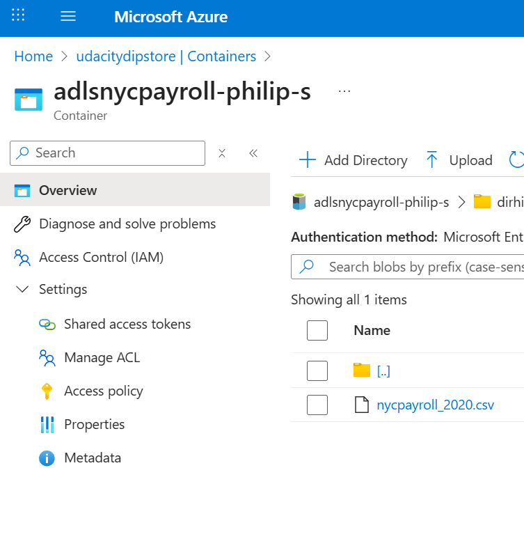 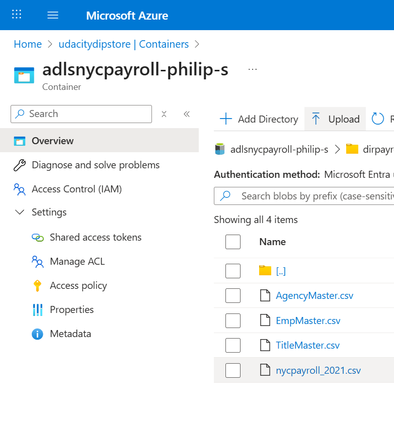
2. Create an Azure Data Factory Resource: ✓.
3. Create a SQL Database ✓.
4. Create Synapse Analytics Workspace and configure external table: ✓. 
5. Create summary data external table in Synapse Analytics workspace: ✓. See [create_external_table.sql](./sql/create_external_table.sql) and 
6. Create master data tables and payroll transaction tables in SQL DB: ✓. See [create_master_tables.sql](./sql/create_master_tables.sql) and 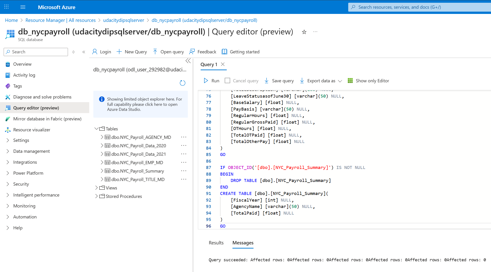

## Step 2: Create linked services
1. Create a Linked Service for Azure Data Lake: ✓. 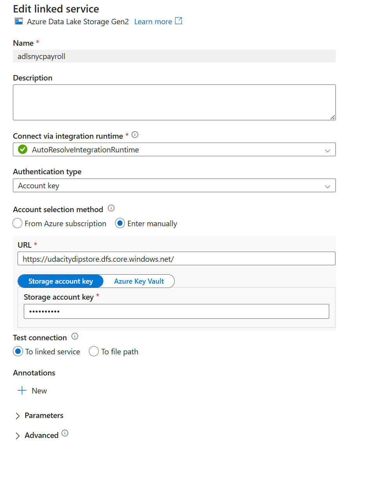
2. Create a Linked Service to SQL Database that has the current (2021) data: ✓. 
3. Screenshot of all linked services in ADF: ✓. 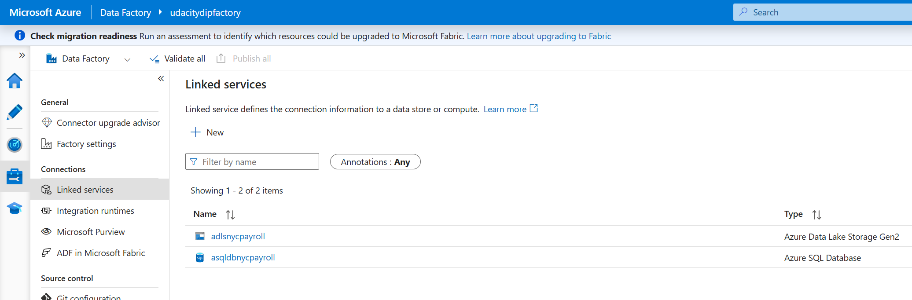

## Step 3: Create datasets in ADF
1. Create the datasets for the 2021 Payroll file on Azure Data Lake Gen2: ✓.
2. Repeat the same process to create datasets for the rest of the data files in the Data Lake: ✓.
3. Create the dataset for all the data tables in SQL DB: ✓.
4. Create the datasets for destination (target) table in Synapse Analytics: ✓.
5. Capture screenshots of datasets in Data Factory: ✓. 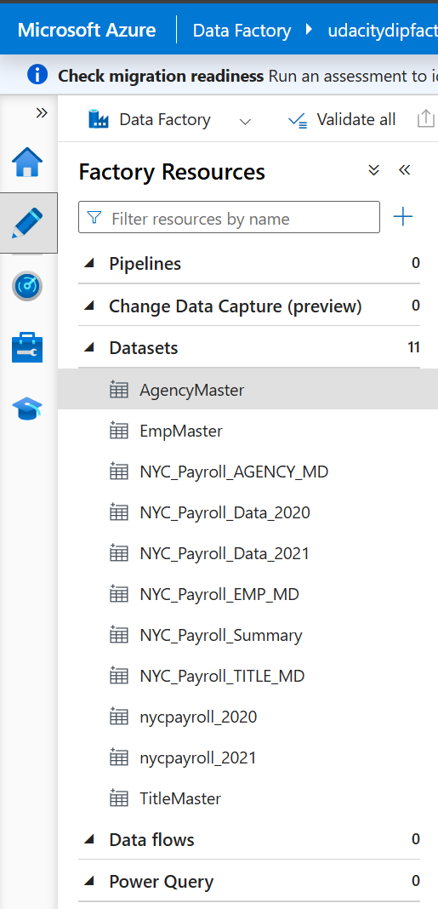
6. Save configs of datasets from Data Factory: ✓. See [datasets](./datasets/) folder.

## Step 4: Create Data Flows
1. Create a new data flow: ✓.
2. Select the dataset for 2020 payroll file as the source: ✓.
3. Click on the + icon at the bottom right of the source, from the options choose sink. A sink will get added in the dataflow: ✓.
4. Select the sink dataset as 2020 payroll table created in SQL db: ✓.
5. Repeat the same process to add data flow to load data for each file in Azure DataLake to the corresponding SQL DB tables: ✓.6. Capture screenshots of data flows in Data Factory: ✓. 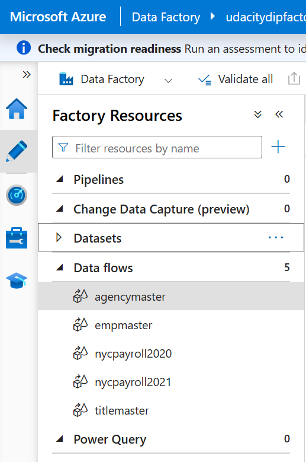
7. Save configs of data flows from Data Factory: ✓. See [dataflows](./dataflows/) folder.

## Step 5: Data Aggregation and Parameterization
1. Create new data flow and name it Dataflow Summary: ✓.
2. Add source as payroll 2020 data from SQL DB: ✓.
3. Add another source as payroll 2021 data from SQL DB: ✓.
4. Create a new Union activity and select both payroll datasets as the source: ✓.
5. Make sure to do any source to target mappings if required. This can be done by adding a Select activity before Union: ✓.
6. After Union, add a Filter activity, go to Expression builder
    a. Create a parameter named- dataflow_param_fiscalyear and give value 2020 or 2021
    b. Include expression to be used for filtering: toInteger(FiscalYear) >= $dataflow_param_fiscalyear: 
7. Now, choose Derived Column after filter: ✓.
    a. Name the column: TotalPaid
    b. Add following expression: RegularGrossPaid + TotalOTPaid+TotalOtherPay
8. Add an Aggregate activity to the data flow next to the TotalPaid activity: ✓.
    a. Under Group by, select AgencyName and FiscalYear
    b. Set the expression to sum(TotalPaid)
9. Add a Sink activity after the Aggregate: ✓.
    a. Select the sink as summary table created in SQL db
    b. In Settings, tick Truncate table
10. Add another Sink activity, this will create two sinks after Aggregate: ✓.
    a. Select the sink as dirstaging in Azure DataLake Gen2 storage
    b. In Settings, tick Clear the folder
11. Capture screenshot of aggregate dataflow in Data Factory: ✓. 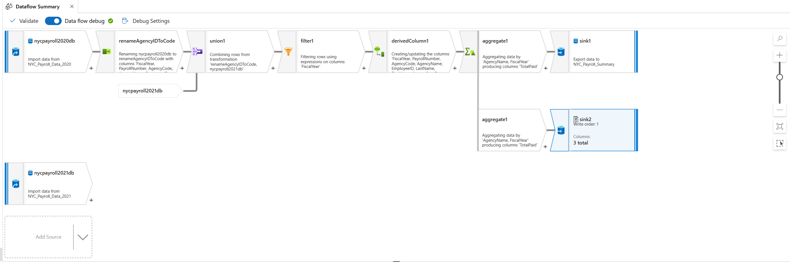
12. Save config of aggregate dataflow from Data Factory: ✓. See [summary_dataflow](./dataflows/dataflow_summary.json).

## Step 6: Pipeline Creation
1. Create a new pipeline: ✓.
2. Include dataflows for Agency, Employee and Title to be parallel: ✓.
3. Add dataflows for payroll 2020 and payroll 2021. These should run only after the initial 3 dataflows have completed: ✓.
4. After payroll 2020 and payroll 2021 dataflows have completed, dataflow for aggregation should be started: ✓.
5. Capture screenshot of pipeline resource from Datafactory: ✓. 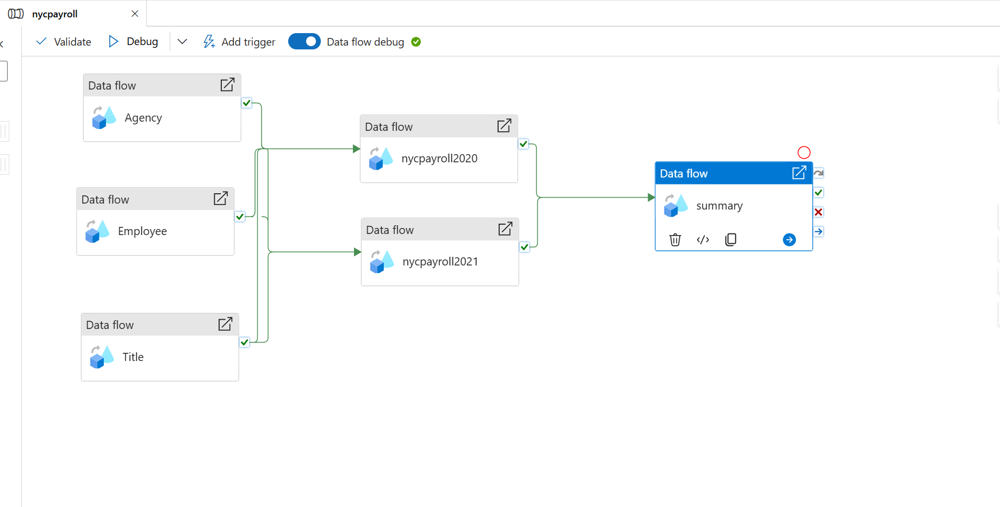
6. Save config of pipeline from Data Factory: ✓. See [nycpayroll](./pipelines/nycpayroll.json).

## Step 7: Trigger and Monitor Pipeline
1. Select Add trigger option from pipeline view in the toolbar: ✓.
2. Choose trigger now to initiate pipeline run: ✓.
3. You can go to monitor tab and check the Pipeline Runs: ✓.
4. Each dataflow will have an entry in Activity runs list: ✓.
5. Capture screenshot of successful pipeline run. All activity runs and dataflow success indicators should be visible: ✓. 

## Step 8: Verify Pipeline run artifacts
1. Query data in SQL DB summary table (destination table). This is one of the sinks defined in the pipeline: ✓.
2. Check the dirstaging directory in Datalake if files got created. This is one of the sinks defined in the pipeline: ✓.
3. Query data in Synapse external table that points to the dirstaging directory in Datalake: ✓.
4. Capture screenshot of query from SQL DB summary table: ✓. 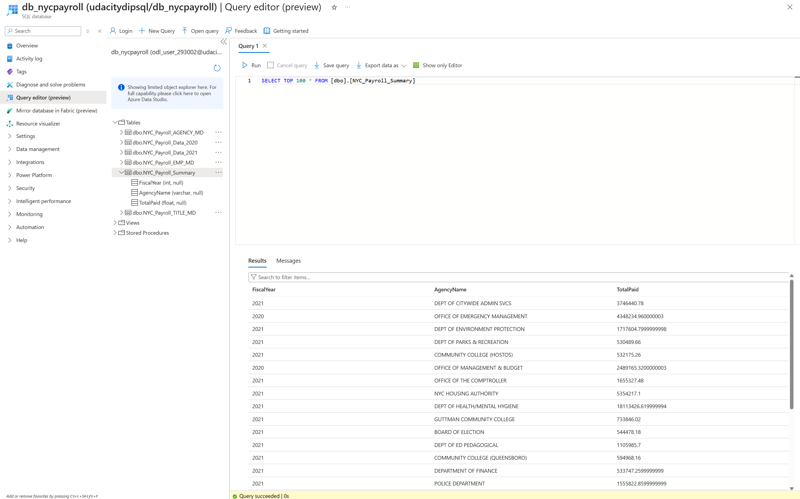
5. Capture screenshot of dirstaging directory listing in Datalake that shows files saved after pipeline runs: ✓. 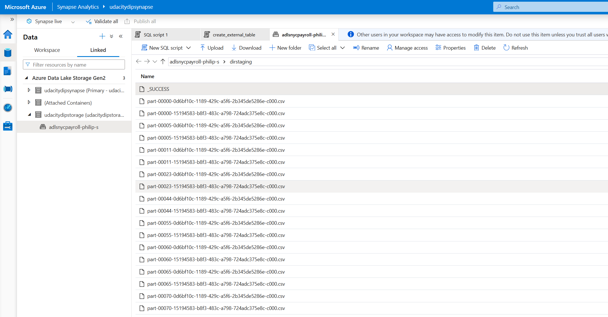
6. Capture screenshot of query from Synapse summary external table: ✓> I got to this point, however right when I was about to run the query, my Azure Data Factory resource got automatically deleted: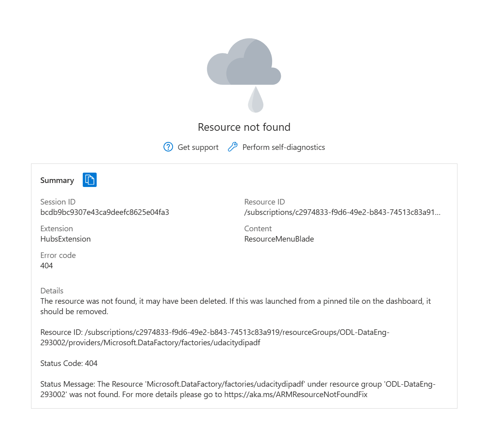. This was the second time this happened in the middle of the project. I have reached out to the support team to understand why this is happening. Meanwhile, I am submitting the project with this one screenshot missing.